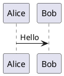
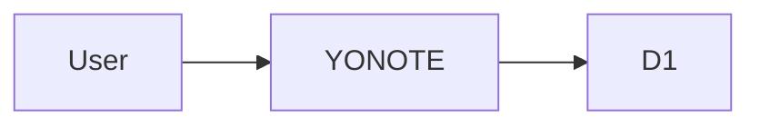

# YONOTE

Ứng dụng ghi chú online dạng single-user, triển khai hoàn toàn trên Cloudflare Workers + D1.

## Tính năng

- Mỗi lần tải lại trang phải nhập Access Key.
- Không có tài khoản hoặc màn hình đăng ký.
- Tạo, sửa, xóa, tìm kiếm và ghim ghi chú.
- Autosave sau 800 ms, hỗ trợ `Ctrl/Cmd + S`.
- Phát hiện conflict khi hai tab cùng sửa một note.
- Markdown + GitHub Flavored Markdown.
- Mermaid render trực tiếp trong browser ở chế độ `securityLevel: strict`.
- PlantUML render hoàn toàn trong browser bằng `@plantuml/core`; không gửi source đến server.
- Live Diagram workspace độc lập với Markdown: chuyển giữa PlantUML và Mermaid, editor + live preview, template, import/export source và SVG.
- Chặn include/import đến file hoặc URL bên ngoài; vẫn cho phép standard-library include dạng `!include <C4/...>` khi bundle hỗ trợ.
- Responsive: sidebar/editor/preview trên desktop; Notes/Edit/Preview theo tab trên mobile.
- Theme System/Light/Dark, ghi nhớ lựa chọn giao diện trên thiết bị.
- Private Offline Mode: note chỉ tồn tại trong RAM, không gọi notes API, không D1; Mermaid và PlantUML đều render local.
- Progressive Web App: có thể cài trên mobile/desktop và mở giao diện khi không có mạng.
- Export note thành file `.md`.
- Key và session token không được lưu trong Local Storage hoặc Session Storage.

## Chế độ hoạt động

### Cloud mode

- Nhập `ACCESS_KEY`.
- Đọc và ghi notes qua Worker API và D1.
- Mermaid và PlantUML đều render trực tiếp trong browser; diagram source không đi qua Worker.

### Live Diagram

- Mở trực tiếp từ màn hình khóa hoặc nút **Live Diagram** trong workspace Notes.
- PlantUML và Mermaid source được giữ riêng trong RAM và không lưu vào D1, `localStorage`, `sessionStorage` hoặc IndexedDB.
- Preview tự render sau 400 ms khi source thay đổi.
- PlantUML có template Sequence, Component, Class và Activity; Mermaid có Flowchart, Sequence, Class và State.
- Hỗ trợ import `.puml`, `.plantuml`, `.mmd`, `.mermaid`, `.txt`; export PlantUML `.puml`, Mermaid `.mmd` và diagram `.svg`.
- Chuyển qua lại giữa Notes và Live Diagram vẫn giữ cả hai source trong phiên hiện tại; refresh/đóng app sẽ xóa source.
- Hoạt động offline sau khi PWA đã cache application shell và PlantUML assets; Mermaid nằm trong JavaScript bundle của ứng dụng.

### Private Offline Mode

- Bỏ qua Access Key và toàn bộ notes API.
- Không đọc/ghi D1, không `POST`, không queue hoặc background sync.
- Nội dung note chỉ giữ trong memory của tab/app hiện tại.
- Refresh, đóng app, Lock hoặc Exit sẽ xóa toàn bộ note offline.
- Dùng **Export** trước khi thoát để giữ file Markdown.
- Mermaid và PlantUML đều hoạt động offline sau khi PWA đã cache application shell và PlantUML assets.

Theme preference được lưu riêng trong `localStorage`; nội dung note offline không được lưu vào `localStorage`, `sessionStorage` hoặc IndexedDB.

## Cài đặt PWA

Sau lần mở online đầu tiên, service worker cache application shell để YONOTE có thể mở khi mất mạng.

- Chrome/Edge desktop hoặc Android: chọn nút **Install app** trong màn hình mở khóa khi browser hỗ trợ.
- iOS/iPadOS Safari: chọn **Share → Add to Home Screen**.
- API request không bao giờ được service worker cache, replay hoặc đưa vào background queue.

## Kiến trúc

```text
React + Vite static assets + PWA service worker
          │
          ├── Notes: Markdown + Mermaid + PlantUML trong browser
          ├── Live Diagram: PlantUML + Mermaid editor và live SVG preview
          │
          ▼
Cloudflare Worker
          ├── POST /api/unlock
          ├── CRUD /api/notes
          └── D1 binding
```

Worker và static assets được deploy thành một đơn vị duy nhất. D1 được Wrangler tự động provision từ binding `DB`; Worker tự tạo schema khi API được gọi lần đầu.

## Yêu cầu

- Node.js 20 trở lên.
- Tài khoản Cloudflare.

## Chạy local

```bash
npm install
cp .dev.vars.example .dev.vars
```

Sửa `.dev.vars`:

```dotenv
ACCESS_KEY=your-local-access-key
TOKEN_SECRET=a-long-random-secret-at-least-32-characters
```

Chạy:

```bash
npm run dev
```

D1 local được Wrangler lưu trong thư mục `.wrangler`.

## Deploy

### 1. Đăng nhập Cloudflare

```bash
npx wrangler login
```

### 2. Tạo file secret production

```bash
cp .env.production.example .env.production
```

Sửa `.env.production`:

```dotenv
ACCESS_KEY=your-production-access-key
TOKEN_SECRET=a-long-random-secret-at-least-32-characters
```

Có thể tạo `TOKEN_SECRET` bằng Node.js:

```bash
node -e "console.log(require('crypto').randomBytes(48).toString('base64url'))"
```

### 3. Build và deploy

```bash
npm run deploy
```

Lệnh này sẽ:

1. Build React SPA.
2. Tạo D1 database nếu chưa tồn tại.
3. Upload `ACCESS_KEY` và `TOKEN_SECRET` dưới dạng Worker Secrets.
4. Deploy Worker cùng static assets.
5. Trả về URL dạng `https://yonote.<subdomain>.workers.dev`.

## Đổi Access Key

Sửa `.env.production`, sau đó chạy lại:

```bash
npm run deploy
```

## Database migration tùy chọn

Worker tự tạo schema nên không bắt buộc chạy migration. File `migrations/0001_init.sql` được giữ để quản lý schema thủ công khi cần.

Sau khi D1 đã được provision và `wrangler.jsonc` có `database_id`, có thể chạy:

```bash
npx wrangler d1 migrations apply yonote-db --remote
```

Tên database thực tế có thể khác khi dùng automatic provisioning; kiểm tra bằng:

```bash
npx wrangler d1 list
```

## Live Diagram, Mermaid và PlantUML offline

Live Diagram hỗ trợ hai engine local. Mermaid dùng package `mermaid` đã bundle cùng ứng dụng; PlantUML dùng engine TeaVM từ package `@plantuml/core`. PlantUML được render trực tiếp trong browser. Diagram source không được gửi đến Worker, Kroki hoặc PlantUML Server. Hai file `plantuml.js` và `viz-global.js` được copy từ dependency vào static assets trong bước build và được service worker cache để dùng offline.
Renderer dùng một hàng đợi tuần tự vì engine PlantUML browser chia sẻ internal state giữa các lần render.

Cú pháp:

````markdown

````

Mermaid:

````markdown

````

## Giới hạn mặc định

- Tối đa 500 notes được tải vào một phiên.
- Một note tối đa khoảng 1 MB UTF-8.
- Token hợp lệ 12 giờ nhưng chỉ được giữ trong memory; refresh vẫn phải nhập Key lại.

## Kiểm tra Offline Mode

1. Mở YONOTE online ít nhất một lần để cài service worker.
2. Chọn **Open private offline mode**.
3. Trong DevTools Network, lọc `api`: không có request `/api/unlock` hoặc `/api/notes`.
4. Bật chế độ Offline của browser và reload app đã cài.
5. Mermaid và PlantUML vẫn render; không có request đến Kroki hoặc PlantUML Server.
6. Exit/Lock hoặc đóng app: note offline bị xóa.
