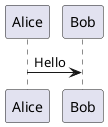
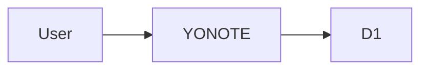

# YONOTE

YONOTE là ứng dụng ghi chú single-user, ưu tiên riêng tư, triển khai trên Cloudflare Workers + D1. Ứng dụng hỗ trợ Markdown, Mermaid, PlantUML, Progressive Web App và một chế độ offline tách biệt hoàn toàn khỏi dữ liệu cloud.

> README này mô tả đúng phạm vi hiện tại trên nhánh `main`: ghi chú Markdown, public read-only link, nhiều theme và Live Diagram chỉ hoạt động trong Private Offline Mode.

## Tính năng

### Ghi chú

- Mỗi lần tải lại trang phải nhập `ACCESS_KEY` để mở Cloud Notes.
- Không có tài khoản, đăng ký hoặc hồ sơ người dùng.
- Tạo, sửa, xóa, tìm kiếm và ghim ghi chú.
- Autosave sau 800 ms và hỗ trợ `Ctrl/Cmd + S`.
- Phát hiện conflict khi hai tab cùng sửa một note.
- Markdown + GitHub Flavored Markdown.
- Export note thành file `.md`.
- Chia sẻ từng Cloud Note bằng public read-only link.
  - Link dùng random share ID và không yêu cầu `ACCESS_KEY`.
  - Nội dung phản ánh phiên bản đã lưu mới nhất của note.
  - Có thể copy hoặc revoke link ngay lập tức.
  - Private Offline Mode không tạo public link.

### Diagram

- Mermaid render trực tiếp trong browser với `securityLevel: strict`.
- PlantUML render hoàn toàn trong browser bằng `@plantuml/core`; source không được gửi đến Worker, Kroki hoặc PlantUML Server.
- Hỗ trợ Mermaid và PlantUML bên trong Markdown.
- Live Diagram workspace độc lập với Markdown, chỉ xuất hiện trong Private Offline Mode.
- Live Diagram hỗ trợ:
  - PlantUML và Mermaid.
  - Editor + live preview.
  - Template có sẵn.
  - Import source.
  - Export source và SVG.
- Chặn PlantUML include/import đến file hoặc URL bên ngoài.
- Vẫn cho phép standard-library include dạng `!include <C4/...>` khi bundle hiện tại hỗ trợ.

### UX, responsive và theme

- Responsive cho desktop, tablet và mobile.
- Desktop: danh sách note, editor và preview theo layout nhiều cột.
- Tablet/mobile: điều hướng rõ ràng giữa Notes, Edit và Preview.
- Trên mobile, ô Note title có nút `×` để xóa nhanh toàn bộ title.
- Hỗ trợ các theme:
  - System.
  - Light.
  - Dark.
  - Midnight.
  - Sepia.
  - Forest.
- Theme preference được ghi nhớ trên thiết bị.
- Theme được áp dụng trước khi React render để giảm hiện tượng nháy giao diện.

### Progressive Web App

- Có thể cài đặt trên mobile và desktop.
- Service worker cache application shell và các engine diagram cần thiết.
- Có thể mở giao diện sau khi đã mất mạng, nếu ứng dụng đã được mở online ít nhất một lần.
- API request không được cache, replay hoặc đưa vào background sync.

## Chế độ hoạt động

### Cloud Mode

- Người dùng nhập `ACCESS_KEY`.
- Notes được đọc và ghi qua Cloudflare Worker API và D1.
- Có thể tạo và revoke public read-only link cho từng Cloud Note.
- Mermaid và PlantUML đều render cục bộ trong browser.
- Diagram source không đi qua Worker.

### Private Offline Mode

Private Offline Mode là một workspace riêng, không dùng Cloud Notes.

Bao gồm:

- Offline Notes.
- Live Diagram:
  - PlantUML.
  - Mermaid.

Đặc điểm:

- Bỏ qua `ACCESS_KEY` và toàn bộ notes API.
- Không đọc hoặc ghi D1.
- Không gửi `POST` note hoặc diagram.
- Không queue request và không background sync.
- Note và diagram source chỉ tồn tại trong RAM của tab/app hiện tại.
- Không lưu nội dung vào `localStorage`, `sessionStorage` hoặc IndexedDB.
- Refresh, đóng app hoặc chọn Exit sẽ xóa toàn bộ:
  - Offline notes.
  - PlantUML source.
  - Mermaid source.
- Dùng Export trước khi thoát để giữ nội dung note hoặc diagram.

Theme preference được lưu riêng trong `localStorage`; nội dung note và diagram offline không được lưu tại đó.

## Live Diagram

Live Diagram chỉ khả dụng bên trong Private Offline Mode.

### PlantUML

Template mặc định:

- Sequence.
- Component.
- Class.
- Activity.

Hỗ trợ import:

- `.puml`
- `.plantuml`
- `.txt`

Hỗ trợ export:

- `.puml`
- `.svg`

### Mermaid

Template mặc định:

- Flowchart.
- Sequence.
- Class.
- State.

Hỗ trợ import:

- `.mmd`
- `.mermaid`
- `.txt`

Hỗ trợ export:

- `.mmd`
- `.svg`

Preview tự render sau một khoảng debounce ngắn khi source thay đổi. Source của PlantUML và Mermaid được giữ riêng trong RAM.

## Cài đặt PWA

Sau lần mở online đầu tiên, service worker cache application shell để YONOTE có thể khởi động khi mất mạng.

- Chrome/Edge desktop hoặc Android: chọn **Install app** khi browser hỗ trợ.
- iOS/iPadOS Safari: chọn **Share → Add to Home Screen**.
- Sau khi deploy phiên bản mới, có thể cần reload hai lần hoặc đóng/mở lại PWA để service worker thay cache cũ.

## Kiến trúc

```text
YONOTE PWA
├── Cloud Mode
│   ├── React Notes UI
│   ├── Markdown / Mermaid / PlantUML local renderer
│   └── Cloudflare Worker API
│       ├── POST /api/unlock
│       ├── GET /api/notes
│       ├── POST /api/notes
│       ├── PATCH /api/notes/:id
│       ├── DELETE /api/notes/:id
│       ├── GET/POST/DELETE /api/notes/:id/share
│       ├── GET /api/shares/:shareId
│       └── Cloudflare D1
│
└── Private Offline Mode
    ├── Offline Notes in RAM
    ├── Markdown / Mermaid / PlantUML local renderer
    └── Live Diagram in RAM
```

Worker và static assets được deploy thành một đơn vị. D1 được bind cố định trong `wrangler.jsonc` bằng `database_name` và `database_id`.

Worker có thể tự bảo đảm schema cơ bản khi API được gọi. Các thay đổi schema mới nên được quản lý bằng migrations để dữ liệu production được cập nhật có kiểm soát.

## Bảo mật và riêng tư

- `ACCESS_KEY` và `TOKEN_SECRET` được cấu hình dưới dạng Cloudflare Worker Secrets.
- Access Key không được lưu trong `localStorage` hoặc `sessionStorage`.
- Session token chỉ được giữ trong memory.
- Refresh trang yêu cầu nhập Access Key lại.
- Token có thời hạn mặc định 12 giờ, nhưng sẽ mất ngay khi reload do không được persist.
- Note và diagram trong Private Offline Mode chỉ tồn tại trong RAM.
- PlantUML và Mermaid render local.
- Bất kỳ ai có public share URL đều có thể đọc phiên bản đã lưu mới nhất cho đến khi link bị revoke.
- Public share API không yêu cầu session token nhưng dùng random 192-bit share ID và trả `Cache-Control: no-store`.
- CSP cho phép WebAssembly cần thiết cho PlantUML bằng `'wasm-unsafe-eval'`, không bật JavaScript `'unsafe-eval'`.

## Yêu cầu

- Node.js 20 trở lên.
- npm.
- Tài khoản Cloudflare.
- Cloudflare D1 database.

## Chạy local

```bash
npm install
cp .dev.vars.example .dev.vars
```

Sửa `.dev.vars`:

```dotenv
ACCESS_KEY=your-local-access-key
TOKEN_SECRET=a-long-random-secret-at-least-32-characters
```

Chạy:

```bash
npm run dev
```

D1 local được Wrangler lưu trong thư mục `.wrangler`.

## Build

```bash
npm run build
```

Build sẽ:

1. Type-check TypeScript.
2. Build React SPA bằng Vite.
3. Copy PlantUML browser assets vào static output.
4. Tạo Mermaid thành lazy-loaded chunks, chỉ tải khi cần render diagram.
5. Tạo Worker deployment bundle và static assets.

## Deploy

### Cách 1: Cloudflare Git integration

Kết nối repository GitHub với Cloudflare Workers Builds.

Cấu hình khuyến nghị:

```text
Production branch: main
Build command: npm run build
Deploy command: npx wrangler deploy
Root directory: /
```

Thêm các Worker Secrets trong Cloudflare Dashboard:

```text
ACCESS_KEY
TOKEN_SECRET
```

Không đưa secret production vào GitHub.

### Cách 2: Deploy bằng Wrangler

Đăng nhập Cloudflare:

```bash
npx wrangler login
```

Tạo file secret production:

```bash
cp .env.production.example .env.production
```

Sửa `.env.production`:

```dotenv
ACCESS_KEY=your-production-access-key
TOKEN_SECRET=a-long-random-secret-at-least-32-characters
```

Tạo `TOKEN_SECRET`:

```bash
node -e "console.log(require('crypto').randomBytes(48).toString('base64url'))"
```

Deploy:

```bash
npm run deploy
```

## Đổi Access Key

Cập nhật secret `ACCESS_KEY` trên Cloudflare Dashboard hoặc trong `.env.production`, sau đó deploy lại.

Không cần thay đổi source code.

## Database migration

Kiểm tra database:

```bash
npx wrangler d1 list
```

Áp dụng migration production:

```bash
npx wrangler d1 migrations apply yonote-db --remote
```

Áp dụng migration local:

```bash
npx wrangler d1 migrations apply yonote-db --local
```

Luôn backup dữ liệu hoặc kiểm tra migration trên D1 local trước khi chạy production.

## Cú pháp diagram trong Markdown

PlantUML:

````markdown

````

Mermaid:

````markdown

````

## Share note

Khi chọn Share:

1. YONOTE lưu các thay đổi đang chờ của note.
2. Người dùng tạo một public read-only link ngẫu nhiên.
3. Bất kỳ ai có link có thể đọc phiên bản đã lưu mới nhất.
4. Người dùng có thể revoke link để vô hiệu hóa quyền truy cập ngay lập tức.

## Giới hạn mặc định

- Tối đa 500 notes được tải vào một phiên.
- Một note tối đa khoảng 1 MB UTF-8.
- Session token có thời hạn 12 giờ nhưng chỉ được giữ trong memory.
- PlantUML browser engine và Graphviz assets làm tăng kích thước PWA cache.
- Một số PlantUML standard-library lớn có thể không có sẵn trong bundle mặc định.
- Private Offline Mode không phải local database; dữ liệu sẽ mất khi thoát hoặc reload.

## Kiểm tra Private Offline Mode

1. Mở YONOTE online ít nhất một lần để service worker cache application shell.
2. Chọn **Open private offline mode**.
3. Tạo note hoặc diagram.
4. Trong DevTools Network, lọc `api`:
   - Không có `/api/unlock`.
   - Không có `/api/notes`.
5. Bật Offline trong DevTools hoặc chế độ máy bay.
6. Mermaid và PlantUML vẫn render.
7. Không có request đến Kroki hoặc PlantUML Server.
8. Export nội dung cần giữ.
9. Chọn Exit hoặc reload: toàn bộ dữ liệu offline phải bị xóa.

## License

Chưa xác định. Thêm file `LICENSE` trước khi public hoặc phân phối rộng rãi.
