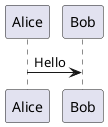
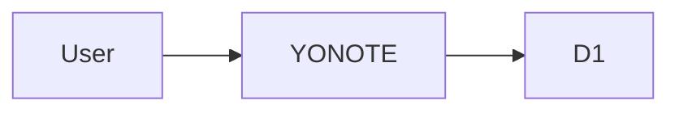

# YONOTE

Ứng dụng ghi chú online dạng single-user, triển khai hoàn toàn trên Cloudflare Workers + D1.

## Tính năng

- Mỗi lần tải lại trang phải nhập Access Key.
- Không có tài khoản hoặc màn hình đăng ký.
- Tạo, sửa, xóa, tìm kiếm và ghim ghi chú.
- Autosave sau 800 ms, hỗ trợ `Ctrl/Cmd + S`.
- Phát hiện conflict khi hai tab cùng sửa một note.
- Markdown + GitHub Flavored Markdown.
- Mermaid render trực tiếp trong browser ở chế độ `securityLevel: strict`.
- PlantUML render qua API serverless, proxy đến Kroki.
- Chặn các directive PlantUML `!include`, `!includeurl`, `!include_many`, `!import`.
- Responsive: sidebar/editor/preview trên desktop; Notes/Edit/Preview theo tab trên mobile.
- Export note thành file `.md`.
- Key và session token không được lưu trong Local Storage hoặc Session Storage.

## Kiến trúc

```text
React + Vite static assets
          │
          ├── Markdown + Mermaid trong browser
          │
          ▼
Cloudflare Worker
          ├── POST /api/unlock
          ├── CRUD /api/notes
          ├── POST /api/plantuml
          └── D1 binding
```

Worker và static assets được deploy thành một đơn vị duy nhất. D1 được Wrangler tự động provision từ binding `DB`; Worker tự tạo schema khi API được gọi lần đầu.

## Yêu cầu

- Node.js 20 trở lên.
- Tài khoản Cloudflare.

## Chạy local

```bash
npm install
cp .dev.vars.example .dev.vars
```

Sửa `.dev.vars`:

```dotenv
ACCESS_KEY=your-local-access-key
TOKEN_SECRET=a-long-random-secret-at-least-32-characters
```

Chạy:

```bash
npm run dev
```

D1 local được Wrangler lưu trong thư mục `.wrangler`.

## Deploy

### 1. Đăng nhập Cloudflare

```bash
npx wrangler login
```

### 2. Tạo file secret production

```bash
cp .env.production.example .env.production
```

Sửa `.env.production`:

```dotenv
ACCESS_KEY=your-production-access-key
TOKEN_SECRET=a-long-random-secret-at-least-32-characters
```

Có thể tạo `TOKEN_SECRET` bằng Node.js:

```bash
node -e "console.log(require('crypto').randomBytes(48).toString('base64url'))"
```

### 3. Build và deploy

```bash
npm run deploy
```

Lệnh này sẽ:

1. Build React SPA.
2. Tạo D1 database nếu chưa tồn tại.
3. Upload `ACCESS_KEY` và `TOKEN_SECRET` dưới dạng Worker Secrets.
4. Deploy Worker cùng static assets.
5. Trả về URL dạng `https://yonote.<subdomain>.workers.dev`.

## Đổi Access Key

Sửa `.env.production`, sau đó chạy lại:

```bash
npm run deploy
```

## Database migration tùy chọn

Worker tự tạo schema nên không bắt buộc chạy migration. File `migrations/0001_init.sql` được giữ để quản lý schema thủ công khi cần.

Sau khi D1 đã được provision và `wrangler.jsonc` có `database_id`, có thể chạy:

```bash
npx wrangler d1 migrations apply yonote-db --remote
```

Tên database thực tế có thể khác khi dùng automatic provisioning; kiểm tra bằng:

```bash
npx wrangler d1 list
```

## Lưu ý PlantUML

PlantUML source được gửi từ Worker đến dịch vụ Kroki public để tạo SVG. Không nên đặt thiết kế mật hoặc dữ liệu nội bộ nhạy cảm trong block PlantUML. Mermaid không có giới hạn này vì được render trực tiếp trong browser.

Cú pháp:

````markdown

````

Mermaid:

````markdown

````

## Giới hạn mặc định

- Tối đa 500 notes được tải vào một phiên.
- Một note tối đa khoảng 1 MB UTF-8.
- PlantUML source tối đa 100 KB.
- Token hợp lệ 12 giờ nhưng chỉ được giữ trong memory; refresh vẫn phải nhập Key lại.
