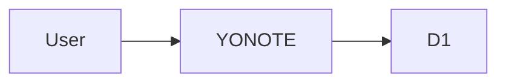
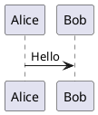

# YONOTE

YONOTE là ứng dụng ghi chú Markdown single-user, ưu tiên riêng tư, chạy trên Cloudflare Workers + D1. Ứng dụng hỗ trợ Mermaid, PlantUML, PWA và một workspace offline tách biệt hoàn toàn khỏi dữ liệu cloud.

> Phạm vi hiện tại: Cloud Notes có public read-only link; Live Diagram chỉ có trong Private Offline Mode.

## Mục lục

- [Tính năng](#tính-năng)
- [Hai chế độ dữ liệu](#hai-chế-độ-dữ-liệu)
- [Chạy local](#chạy-local)
- [Build và deploy](#build-và-deploy)
- [Kiến trúc](#kiến-trúc)
- [External API](#external-api)
- [Bảo mật và riêng tư](#bảo-mật-và-riêng-tư)
- [Diagram](#diagram)
- [Giới hạn](#giới-hạn)

## Tính năng

- Tạo, sửa, xóa, tìm kiếm, ghim và export ghi chú Markdown.
- Autosave sau 800 ms; hỗ trợ lưu ngay bằng `Ctrl/Cmd + S`.
- Phát hiện conflict khi nhiều tab cùng sửa một note.
- GitHub Flavored Markdown, Mermaid và PlantUML render ngay trong trình duyệt.
- Public read-only link cho từng Cloud Note; có thể copy hoặc revoke ngay.
- External CRUD API v1 dùng API key có scope, revoke, expiration và cursor pagination.
- Responsive trên desktop, tablet và mobile; điều hướng bằng bàn phím, focus rõ và vùng bấm thân thiện với cảm ứng.
- Sáu lựa chọn theme: System, Light, Dark, Midnight, Sepia và Forest.
- Cài đặt như PWA; application shell dùng được sau lần mở online đầu tiên.
- CodeMirror 6 cho Markdown và diagram source, gồm tìm kiếm, undo/redo, line numbers, fold, bracket matching, phím tắt và toolbar định dạng.
- Live Diagram cho Mermaid và PlantUML trong Private Offline Mode, với split pane có thể resize và canvas hỗ trợ zoom, pan, fit, fullscreen.

## Hai chế độ dữ liệu

| | Cloud Mode | Private Offline Mode |
|---|---|---|
| Mở workspace | Nhập `ACCESS_KEY` | Không cần key |
| Nơi giữ note | Cloudflare D1 | RAM của tab/app hiện tại |
| Notes API | Có | Không |
| Public share | Có | Không |
| Live Diagram | Không | Có |
| Sau refresh/đóng app | Nhập key lại, dữ liệu vẫn ở D1 | Toàn bộ nội dung bị xóa |

Private Offline Mode không phải local database. Note và diagram source không được ghi vào `localStorage`, `sessionStorage` hoặc IndexedDB, không được queue để đồng bộ sau, và sẽ mất khi refresh, thoát hoặc khóa app. Hãy export nội dung cần giữ trước khi rời workspace.

Chỉ theme và tùy chọn layout được lưu trên thiết bị; `ACCESS_KEY`, session token và nội dung offline không được lưu ở đó.

## Chạy local

Yêu cầu: Node.js 22.12+ (khuyến nghị), npm, tài khoản Cloudflare và một D1 database.

```bash
npm install
cp .dev.vars.example .dev.vars
```

Cập nhật `.dev.vars`:

```dotenv
ACCESS_KEY=your-local-access-key
TOKEN_SECRET=a-long-random-secret-at-least-32-characters
API_ALLOWED_ORIGINS=http://localhost:5173
```

Khởi động môi trường phát triển:

```bash
npm run dev
```

Wrangler lưu D1 local trong thư mục `.wrangler`.

### Các lệnh chính

| Lệnh | Mục đích |
|---|---|
| `npm run dev` | Copy PlantUML assets và chạy Vite |
| `npm run typecheck` | Kiểm tra TypeScript |
| `npm run build` | Type-check, build SPA và Worker bundle |
| `npm run deploy` | Build và deploy bằng Wrangler |
| `npm run cf-typegen` | Tạo lại Cloudflare binding types |

## Build và deploy

### Cloudflare Git integration

Kết nối repository với Cloudflare Workers Builds và dùng cấu hình:

```text
Production branch: main
Build command: npm run build
Deploy command: npx wrangler deploy
Root directory: /
```

Thêm `ACCESS_KEY` và `TOKEN_SECRET` trong Cloudflare Dashboard dưới dạng Worker Secrets. Khi external API được gọi trực tiếp từ browser, cấu hình biến `API_ALLOWED_ORIGINS` bằng danh sách origin chính xác, phân tách bởi dấu phẩy. Không commit secret production vào GitHub.

### Wrangler

```bash
npx wrangler login
cp .env.production.example .env.production
```

Cập nhật `.env.production`, rồi tạo `TOKEN_SECRET` mạnh nếu cần:

```bash
node -e "console.log(require('crypto').randomBytes(48).toString('base64url'))"
npm run deploy
```

Để đổi Access Key, cập nhật secret `ACCESS_KEY` rồi deploy lại; không cần sửa source code.

### Database migration

Kiểm tra migration trên D1 local trước, đồng thời backup dữ liệu trước khi áp dụng lên production.

```bash
npx wrangler d1 migrations apply yonote-db --local
npx wrangler d1 migrations apply yonote-db --remote
```

## Kiến trúc

```text
YONOTE PWA
├── React SPA
│   ├── Cloud Notes workspace
│   ├── Private Offline workspace (RAM only)
│   └── Markdown / Mermaid / PlantUML local renderer
└── Cloudflare Worker
    ├── Session unlock
    ├── Notes CRUD + conflict detection
    ├── Public read-only shares
    ├── External CRUD API v1 + scoped API keys
    └── Cloudflare D1
```

Worker và static assets được deploy thành một đơn vị. D1 binding được khai báo trong `wrangler.jsonc`; thay đổi schema nên đi qua `migrations/`.

### API chính

| Method | Endpoint | Mục đích |
|---|---|---|
| `POST` | `/api/unlock` | Đổi Access Key lấy session token |
| `GET`, `POST` | `/api/notes` | Liệt kê hoặc tạo note |
| `PATCH`, `DELETE` | `/api/notes/:id` | Cập nhật hoặc xóa note |
| `GET`, `POST`, `DELETE` | `/api/notes/:id/share` | Đọc, tạo hoặc revoke share link |
| `GET` | `/api/shares/:shareId` | Đọc public shared note |

## External API

External API nằm dưới namespace `/api/v1` và không dùng session token từ `/api/unlock`. Client phải dùng API key dài hạn dạng `yn_...` qua header `Authorization: Bearer <key>`. Key chỉ được trả plaintext một lần khi tạo; D1 chỉ lưu SHA-256 hash.

API key được quản lý bằng session Cloud Mode:

| Method | Endpoint | Mục đích |
|---|---|---|
| `GET`, `POST` | `/api/api-keys` | Liệt kê metadata hoặc tạo API key |
| `DELETE` | `/api/api-keys/:id` | Revoke API key |

Public CRUD API:

| Method | Endpoint | Scope |
|---|---|---|
| `GET`, `POST` | `/api/v1/notes` | `notes:read` / `notes:write` |
| `GET`, `PATCH`, `DELETE` | `/api/v1/notes/:id` | `notes:read` / `notes:write` |
| `GET` | `/api/v1/health` | Không yêu cầu key |

Danh sách note hỗ trợ `limit`, `cursor`, `pinned`, `q` và `updatedAfter`; response danh sách không trả `content`. Cập nhật note bắt buộc gửi `expectedVersion` để giữ optimistic concurrency. Xem hướng dẫn đầy đủ tại [`docs/external-api.md`](docs/external-api.md) và schema tại [`openapi.yaml`](openapi.yaml).

## Bảo mật và riêng tư

- `ACCESS_KEY` và `TOKEN_SECRET` là Cloudflare Worker Secrets.
- Access Key không được lưu trong browser storage; session token chỉ giữ trong memory.
- Reload trang yêu cầu nhập Access Key lại. Token phía server có thời hạn mặc định 12 giờ.
- Mermaid dùng `securityLevel: strict`.
- PlantUML chạy bằng `@plantuml/core`; diagram source không được gửi đến Worker, Kroki hoặc PlantUML Server.
- PlantUML chặn include/import đến file hoặc URL bên ngoài; standard-library include dạng `!include <C4/...>` chỉ hoạt động khi có trong bundle.
- Public share dùng random 192-bit share ID và trả `Cache-Control: no-store`. Bất kỳ ai có URL đều đọc được phiên bản đã lưu mới nhất cho đến khi link bị revoke.
- External API key dùng random 256-bit secret, chỉ lưu hash, có scope `notes:read`/`notes:write`, expiration và revoke.
- Browser CORS mặc định bị tắt; chỉ origin có trong `API_ALLOWED_ORIGINS` được phép gửi request external API. Server-to-server client không cần cấu hình CORS.
- CSP chỉ cho phép WebAssembly cần thiết qua `'wasm-unsafe-eval'`, không bật JavaScript `'unsafe-eval'`.
- Service worker không cache, replay hoặc background-sync API request.

## Diagram

Trong Markdown:

````markdown



````

Live Diagram trong Private Offline Mode có editor + live preview, template và import/export:

| Engine | Template | Import | Export |
|---|---|---|---|
| PlantUML | Sequence, Component, Class, Activity | `.puml`, `.plantuml`, `.txt` | `.puml`, `.svg` |
| Mermaid | Flowchart, Sequence, Class, State | `.mmd`, `.mermaid`, `.txt` | `.mmd`, `.svg` |

Editor source dùng CodeMirror 6. `Tab`/`Shift + Tab` thụt lề, `Ctrl/Cmd + F` tìm kiếm, và undo/redo dùng phím tắt chuẩn của hệ điều hành. Trên desktop, kéo thanh chia giữa source và preview để đổi kích thước; dùng phím mũi tên khi thanh chia được focus hoặc double-click để reset.

### Điều khiển preview

- Kéo bằng chuột hoặc một ngón tay để di chuyển diagram.
- Cuộn bằng wheel/touchpad để pan; pinch hoặc `Ctrl/Cmd + wheel` để zoom tại vị trí con trỏ.
- Dùng các nút `−`, phần trăm và `+` để zoom từ 25% đến 400%; chọn phần trăm hoặc double-click preview để trở về 100% và căn giữa.
- Chọn **Fit** để vừa diagram với canvas và **Full** để xem toàn màn hình.
- Khi preview được focus, dùng `+`, `-`, `0`, `F` và các phím mũi tên. Giữ `Shift` cùng phím mũi tên để pan nhanh hơn.
- Mức zoom và vị trí được giữ khi source render lại, nhưng reset khi chuyển giữa PlantUML và Mermaid.

## PWA và kiểm tra offline

- Chrome/Edge desktop hoặc Android: chọn **Install app** khi trình duyệt hỗ trợ.
- iOS/iPadOS Safari: chọn **Share → Add to Home Screen**.
- Sau khi deploy phiên bản mới, có thể cần reload hai lần hoặc đóng/mở lại PWA để thay cache cũ.

Để xác minh Private Offline Mode:

1. Mở YONOTE online ít nhất một lần để cache application shell.
2. Mở **Private Offline Mode**, tạo note hoặc diagram.
3. Trong DevTools Network, xác nhận không có request `/api/unlock` hoặc `/api/notes`.
4. Bật Offline/chế độ máy bay và xác nhận Mermaid, PlantUML vẫn render mà không gọi server ngoài.
5. Export nội dung cần giữ; reload hoặc Exit phải xóa toàn bộ dữ liệu offline.

## Giới hạn

- Tối đa 500 notes trong một phiên.
- Một note tối đa khoảng 1 MB UTF-8.
- PlantUML browser engine và Graphviz assets làm tăng kích thước PWA cache.
- Một số PlantUML standard library lớn có thể không có trong bundle mặc định.
- Private Offline Mode không lưu bền dữ liệu.

## License

Chưa xác định. Thêm file `LICENSE` trước khi phân phối rộng rãi.
